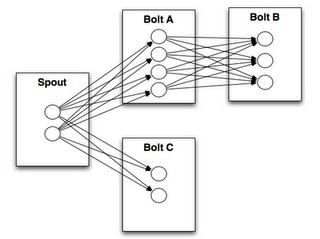

## 简介
Strom是一个流处理(Stream Processing)框架。
Storm用户3中场景：事件流(Stream Processing)，持续计算(continuous computation)、分布式RPC(Distributed RPC)。针对这些场景，Storm设计了自己的计算模型:

Storm Topology

Storm Stream Grouping

Storm High Level Architecture

在一个Storm集群中，有主从两种不同的节点，三种不同的daemon：

* Nimbus运行在主节点上，通关全局
* 从节点上运行Supervisor，管理相关节点上的任务
* 每个从节点上还有一系列的worker process来运行具体任务

和我们熟知的Hadoop不一样的是， 这些daemon间并不直接发送心跳信息或者存在其他RPC控制协议。如图所示，他们之间的信息交换统统是通过Zookeeper来实现。这样的设计虽然引入了Zookeeper这个第三方依赖，但其极大的简化了Nimbus/Supervisor/Worker本身的设计，考虑到Zookeeper已经被广泛接受，已经成为分布式系统metadata store的事实解决方案，Storm在设计时所做的这个折中相当不错。

作为主节点， Nimbus类似于Hadoop中的Jobtracker，主要负责接收客户端提交的Topology，进行相应的验证，分配任务，进而把任务相关的元信息写入Zookeeper相应目录，此外，Nimbus还负责通过Zookeeper来监控任务执行情况。而Supervisor则类似于TaskTracker，负责会监听任务分配情况，根据实际情况启动/停止工作进程（worker）。相应的，Worker和Hadoop中的map/reduce task很类似，实际的数据处理发生在这里。 不同的是，map/reduce task 终究会结束，但worker则会一直执行下去。

