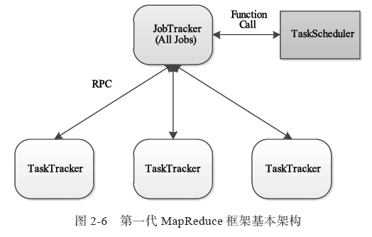
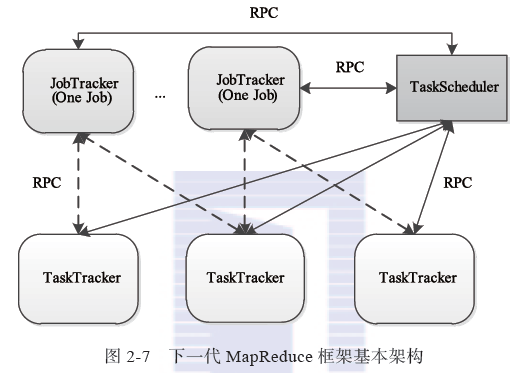
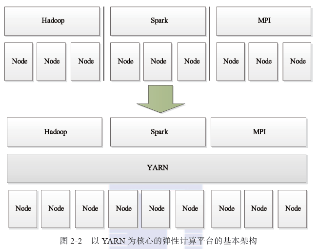

YARN（Yet Another Resource Negotiator）是下一代Hadoop的一个分支，它是一个资源管理系统，其上可以运行各种计算框架和应用程序。

YARN是未来的一个趋势，YARN本身已经变成了一个云操作系统，很多新的计算框架或者应用程序不再基于传统的操作系统开发（比如Linux）,而是基于YARN这个云操作系统，YARN提供了资源管理和资源调度等机制，这意味着，很多新的计算框架或者应用程序脱离了YARN将不再可以单独运行，典型的代表是DAG计算框架Tez和Spark（Spark也可以运行在另一个与YARN类似的资源管理系统Mesos上）。

随着开源界的发展和推进，最终，YARN之上可以运行各种应用类型的计算框架，包括离线计算框架MapReduce，实时计算框架Storm，DAG计算框架Tez等，真正实现一个集群多用途，这样的集群或者系统，我们通常称为轻量级弹性计算平台，说它轻量级，是因为YARN采用了cgroups轻量级隔离方案，说它弹性，是因为YARN能根据各种计算框架或者应用的负载或者需求调整它们各自占用的资源，实现集群资源共享，资源弹性收缩。

MapReduce has undergone a complete overhaul in hadoop-0.23 and we now have, what we call, MapReduce 2.0 (MRv2) or YARN.

The fundamental idea of MRv2 is to split up the two major functionalities of the JobTracker, resource management and job scheduling/monitoring, into separate daemons. The idea is to have a global ResourceManager (RM) and per-application ApplicationMaster (AM). An application is either a single job in the classical sense of Map-Reduce jobs or a DAG of jobs.

[运行在YARN上的计算框架](http://dongxicheng.org/framework-on-yarn/distributed-computing-framework-on-yarn/)

## MRv1与YARN的框架对比
在Hadoop 1.0中，JobTracker由资源管理(在TaskScheduler中实现)和作业控制(在JobTracker中实现)两部分组成。当前Hadoop MapReduce之所以在可扩展性、资源利用率和多框架支持等方面存在不足，正是由于Hadoop对JobTracker赋予的功能过多而造成负载过重。此外，从设计的角度看，Hadoop未能将资源管理相关的功能和应用程序相关的功能分开，造成Hadoop难以支持多种计算框架。

下一代Mapduce框架的基本设计思想是将JobTracer的两个主要功能，即资源管理和作业控制（包括作业监控、容错等），分拆成两个独立的进程。
资源管理进程与具体应用程序无关，它负责整个集群的资源（内存、CPU、磁盘等）管理，而作业控制进程则是直接与应用程序相关的模块，且每个作业控制进程只负责管理一个作业。这样，通过将原有JobTracker中与应用程序相关和无关的模块分开，不仅减轻了JobTracker负责，也使得Hadoop支持更多的计算框架。

从资源管理的角度看，下一代MapReduce框架实际上衍生出一个资源统一管理平台YARN，它使得Hadoop不再局限于仅支持MapReduce一种计算模型，而是可无限融入多种计算框架，且对这些框架进行统一管理和调度。

