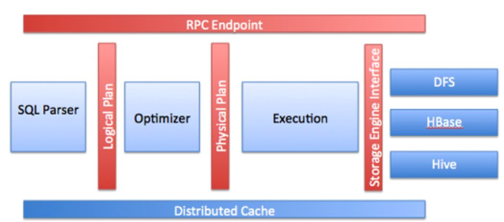
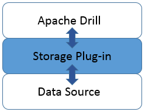

## Overview
Apache Drill is a low latency distributed query engine for large-scale datasets, including structured and semi-structured/nested data.

Drill uses ZooKeeper to maintain cluster membership and health-check information.

Note that though Drill works in a Hadoop cluster environment, Drill is not tied to Hadoop and can run in any distributed cluster environment. __The only pre-requisite for Drill is Zookeeper__.

Drill使用Zookeeper管理各节点信息。分布式部署时，客户端向Zookeeper请求数据。

## Query Flow in Drill


1. The Drill client issues a query. Any Drillbit in the cluster can accept queries from the clients. There is no master-slave concept.
2. The Drillbit then parses the query, optimizes it, and generates a distributed query plan that is optimized for fast and efficient execution.
3. The Drillbit that accepts the query becomes the driving Drillbit node for the request. It gets a list of available Drillbit nodes in the cluster from ZooKeeper. The driving Drillbit determines the appropriate nodes to execute various query plan fragments to maximize data locality.
4. The Drillbit schedules the execution of query fragments on individual nodes according to the execution plan.
5. The individual nodes finish their execution and return data to the driving Drillbit.
6. The driving Drillbit streams results back to the client.

## Core Modules within a Drillbit


* RPC end point : 使用低开销的基于protobuf的RPC协议，实现与客户端的通信，同时实现了C++、JAVA的API接口。

## Connecting to Datasource


Apache drill通过Storage plugin与数据源通信。

### Storage Plugin Registration
Drill的数据源包括文件、Hive、HBASE等。将Drill连接到数据源，首先需要在Drill Web UI将数据源注册为存储插件的一个实例。

每一个安装了Drillbit的节点都运行了Drill Web UI服务，可以通过http://localhost:8047/。Drill Web UI默认包含cp,dfs,hive和hbase存储插件。hive, hbase默认是不可用状态。

cp实例指向Drill的classpath下的一个JAR文件，包含一些样本数据。
dfs实例默认指向本地文件系统，可以配置指向分布式文件系统，如Hadoop.

分布式部署环境下，在一个Drill节点添加或更新存储插件实例时，Drill会自动向其它的节点广播这一信息，最终所有的节点会具有相同的存储插件配置。不需要在其他节点重复修改或进行重启操作。

## SQLLine 
SQLLine是drill的命令行工具，可以连接数据库，执行SQL命令。

## Web UI
访问http://localhost:8047/可进入drill的Web管理界面。
Web管理界面使用Jetty实现。


## 遇到的问题
* 前台页面引用了google服务器的jquery, bootstrap代码，国内访问非常慢，需要使用国内的cdn。

修改apache-drill-0.4.0-incubating\jars\drill-java-exec-0.4.0-incubating-rebuffed.jar中的generic.ftl文件内容：

```
      <link href="http://libs.baidu.com/bootstrap/3.0.3/css/bootstrap.min.css" rel="stylesheet">

      <script src="http://libs.baidu.com/jquery/1.9.0/jquery.js"></script>
      <script src="http://libs.baidu.com/bootstrap/3.0.3/js/bootstrap.min.js"></script>
```

* hostname配置错误导致Drillbit服务启动失败

linux系统修改了主机名，但是在/etc/hosts文件中没有配置。
sqlline使用embedded模式启动Drillbit服务时，报错：
"Failure while start Drillbit in embedded mode"

查看sqlline.log，发现以下信息

<code>o.apache.drill.exec.server.Drillbit - Drillbit environment:.host.name=<NA></code>

这是zookeeper代码中产生的错误，获取主机名时出错。

```
try {
    put(l, "host.name",
        InetAddress.getLocalHost().getCanonicalHostName());
} catch (UnknownHostException e) {
    put(l, "host.name", "<NA>");
}
```

配置/etc/hosts文件后，问题解决。
