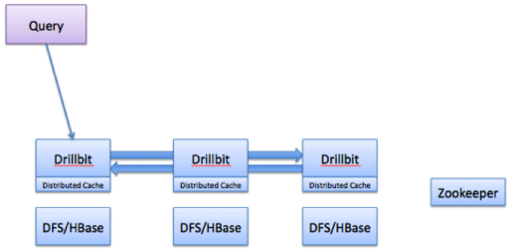

## Overview
Apache Drill is a low latency distributed query engine for large-scale datasets, including structured and semi-structured/nested data.

Drill uses ZooKeeper to maintain cluster membership and health-check information.

Note that though Drill works in a Hadoop cluster environment, Drill is not tied to Hadoop and can run in any distributed cluster environment. __The only pre-requisite for Drill is Zookeeper__.

## Query Flow in Drill

1. The Drill client issues a query. Any Drillbit in the cluster can accept queries from the clients. There is no master-slave concept.
2. The Drillbit then parses the query, optimizes it, and generates a distributed query plan that is optimized for fast and efficient execution.
3. The Drillbit that accepts the query becomes the driving Drillbit node for the request. It gets a list of available Drillbit nodes in the cluster from ZooKeeper. The driving Drillbit determines the appropriate nodes to execute various query plan fragments to maximize data locality.
4. The Drillbit schedules the execution of query fragments on individual nodes according to the execution plan.
5. The individual nodes finish their execution and return data to the driving Drillbit.
6. The driving Drillbit streams results back to the client.

