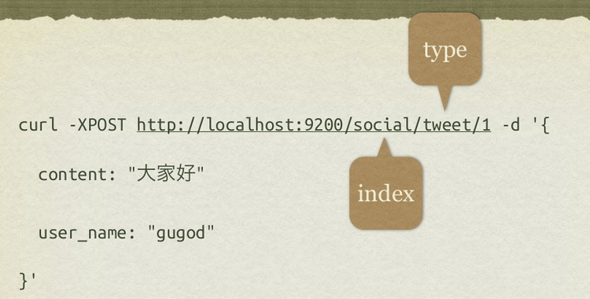

## ElasticSearch的几个重要概念

[参考PPT](../../download/elasticsearch/elasticsearch-intro.pdf)

ElasticSearch是一个分布式近实时搜索引擎。

* Restful访问接口
* 在Lucene基础上发展而来
* NoSQL的解决方案

与关系型数据库的比较
<table>
<thead>
<tr><th>关系型数据库</th><th>ElasticSearch</th></tr>
</thead>
<tbody>
	<tr>
        <td>database</td>
        <td>index</td>
	</tr>
	<tr>
        <td>table</td>
        <td>type</td>
	</tr>
	<tr>
        <td>row</td>
        <td>document</td>
	</tr>
	<tr>
        <td>column</td>
        <td>field</td>
	</tr>
	<tr>
        <td>schema</td>
        <td>mapping</td>
	</tr>
	<tr>
        <td>index</td>
        <td>全部索引</td>
	</tr>
	<tr>
        <td>SQL</td>
        <td>query DSL</td>
	</tr>
</tbody>
</table>

一个创建索引的示例

[这篇文章](http://www.jianshu.com/p/492d4311ed04)写的更好

### analysis
Analysis is the process of converting full text to terms. Depending on which analyzer is used, these phrases: FOO BAR, Foo-Bar, foo,bar will probably all result in the terms foo and bar. These terms are what is actually stored in the index. A full text query (not a term query) for FoO:bAR will also be analyzed to the terms foo,bar and will thus match the terms stored in the index. It is this process of analysis (both at index time and at search time) that allows elasticsearch to perform full text queries. 

分析(analyse)是将全文本转换成项(term)的过程。索引阶段、查询阶段都会对文本进行分析。

### term(项)
A term is an exact value that is indexed in elasticsearch. The terms foo, Foo, FOO are NOT equivalent. Terms (i.e. exact values) can be searched for using term queries. See also text and analysis.

项是在ES中被索引的确切的值。项foo、Foo、FOO不是等价的。项（确切值）可以通过term查询而被搜索到。

### text
Text (or full text) is ordinary unstructured text, such as this paragraph. By default, text will be analyzed into terms, which is what is actually stored in the index. Text fields need to be analyzed at index time in order to be searchable as full text, and keywords in full text queries must be analyzed at search time to produce (and search for) the same terms that were generated at index time. See also term and analysis.

文本（或者全文）是一般的非结构化文本，就像这篇文章。文本默认地会被分析成项（term），项是直接存放在索引中的。文本的字段需要在索引时被分析，从而可以作为全文可搜索的，而在全文查询中的关键词（keyword）必须在搜索时进行分析来产生（和检索）在索引时生成的同样的项（term）。请查看项（term）和分析（analysis）。

### index(索引，相当于一个数据库)
An index is like a database in a relational database. It has a mapping which defines multiple types. An index is a logical namespace which maps to one or more primary shards and can have zero or more replica shards.

索引(index)相当于关系型数据库中的数据库。索引包含一个映射(mapping)，映射定义了索引中的每种类型。索引是一个逻辑命名空间，该空间可以对应于一个或者多个主shard，并且有零个或多个从shard。

### type(类型，相当于数据库中的表)
A type is like a table in a relational database. Each type has a list of fields that can be specified for documents of that type. The mapping defines how each field in the document is analyzed.

类型如同关系数据库中的表。每个类型有一个字段的列表，该列表可以被指定为该类型的文档。映射则定义了文档的每个字段将如何被分析。

### mapping(相当于数据库中的模式schema)
A mapping is like a schema definition in a relational database. Each index has a mapping, which defines each type within the index, plus a number of index-wide settings. A mapping can either be defined explicitly, or it will be generated automatically when a document is indexed.

映射（mapping）就如同一个在关系数据库中的模式定义。每个索引都有一个映射，映射定义了索引中每个类型，加上一堆索引范围内的设置。映射可以显式定义，或者会在文档被索引时自动产生。

### doucument(文档，相当于数据库中的一行记录)
A document is a JSON document which is stored in elasticsearch. It is like a row in a table in a relational database. Each document is stored in an index and has a type and an id. A document is a JSON object (also known in other languages as a hash / hashmap / associative array) which contains zero or more fields, or key-value pairs. The original JSON document that is indexed will be stored in the _source field, which is returned by default when getting or searching for a document.

### id 
The ID of a document identifies a document. The index/type/id of a document must be unique. If no ID is provided, then it will be auto-generated. (also see routing)

### field
A document contains a list of fields, or key-value pairs. The value can be a simple (scalar) value (eg a string, integer, date), or a nested structure like an array or an object. A field is similar to a column in a table in a relational database. The mapping for each field has a field type (not to be confused with document type) which indicates the type of data that can be stored in that field, eg integer, string, object. The mapping also allows you to define (amongst other things) how the value for a field should be analyzed.

### cluster
代表一个集群，集群中有多个节点，其中有一个为主节点，这个主节点是可以通过选举产生的，主从节点是对于集群内部来说的。es的一个概念就是去中心化，字面上理解就是无中心节点，这是对于集群外部来说的，因为从外部来看es集群，在逻辑上是个整体，你与任何一个节点的通信和与整个es集群通信是等价的。

### shards
代表索引分片，es可以把一个完整的索引分成多个分片，这样的好处是可以把一个大的索引拆分成多个，分布到不同的节点上。构成分布式搜索。分片的数量只能在索引创建前指定，并且索引创建后不能更改。

Shard就是一个单独的Lucene实例。他是一个底层的工作单元，被ES自动地管理。索引是逻辑命名空间，其指向了主／从shard。你不需要直接访问shard，不需要定义索引需要的主／从shard的数目。相反，你的代码只需要与索引打交道。ES分发shard到集群中所有节点（node），并且可以在节点挂掉或者新节点增加时自动地把shard从一个节点迁移到另一个。

### source field
被索引的JSON文档默认地会存放在_source字段中，并且将被所有get和search请求返回。这给予你直接从搜索结果获取原始对象的能力，而不需要二次请求，从一个ID查询对象。注意：被索引的JSON字符串将被返回给你，即使他包含了非法的JSON。这个字段的内容不暗示任何关于在这个对象中的数据已被索引的信息。

### replicas
代表索引副本，es可以设置多个索引的副本，副本的作用一是提高系统的容错性，当个某个节点某个分片损坏或丢失时可以从副本中恢复。二是提高es的查询效率，es会自动对搜索请求进行负载均衡。

### recovery
代表数据恢复或叫数据重新分布，es在有节点加入或退出时会根据机器的负载对索引分片进行重新分配，挂掉的节点重新启动时也会进行数据恢复。

### river
代表es的一个数据源，也是其它存储方式（如：数据库）同步数据到es的一个方法。它是以插件方式存在的一个es服务，通过读取river中的数据并把它索引到es中，官方的river有couchDB的，RabbitMQ的，Twitter的，Wikipedia的，river这个功能将会在后面的文件中重点说到。

### gateway
代表es索引的持久化存储方式，es默认是先把索引存放到内存中，当内存满了时再持久化到硬盘。当这个es集群关闭再重新启动时就会从gateway中读取索引数据。es支持多种类型的gateway，有本地文件系统（默认），分布式文件系统，Hadoop的HDFS和amazon的s3云存储服务。

### discovery.zen
代表es的自动发现节点机制，es是一个基于p2p的系统，它先通过广播寻找存在的节点，再通过多播协议来进行节点之间的通信，同时也支持点对点的交互。

### Transport
代表es内部节点或集群与客户端的交互方式，默认内部是使用tcp协议进行交互，同时它支持http协议（json格式）、thrift、servlet、memcached、zeroMQ等的传输协议（通过插件方式集成）。

[配置文件详解](http://www.nosqldb.cn/1368776094942.html)

elasticsearch的config文件夹里面有两个配置文件：elasticsearch.yml和logging.yml，第一个是es的基本配置文件，第二个是日志配置文件，es也是使用log4j来记录日志的，所以logging.yml里的设置按普通log4j配置文件来设置就行了。

